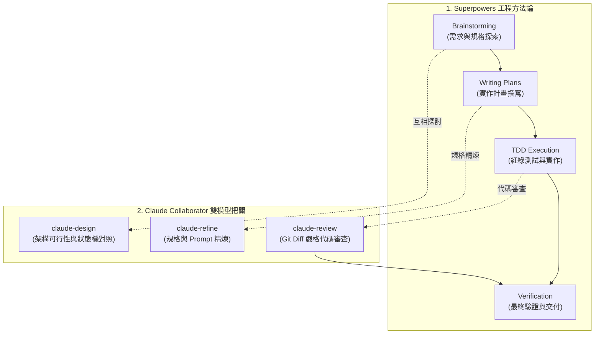

# 🤝 Claude Collaborator (雙代理人協同架構 Skill & CLI)

> **Antigravity / Gemini + Claude CLI 雙代理人深度協作與交叉驗證系統**
> 具備自動優雅降級（Graceful Fallback）、模組化安裝與 Superpowers 工作流無縫整合。

---

## 🧩 概念解構：與 Antigravity / Superpowers 的關係

很多開發者初次接觸時會好奇這三者的關係：

* **Antigravity**：Google 的新一代 Agentic AI 編程環境（支援全專案檢索、工具鏈執行與自回歸推演）。
* **[Superpowers](https://github.com/obra/superpowers)**：一套專為 Coding Agents 設計的軟體工程方法論框架（提供 Brainstorming、Spec First、TDD 實作計畫與驗收紀律）。
* **Claude Collaborator（本專案）**：一個**完全獨立、解耦的雙代理人協同引擎（Skill & CLI）**。
  * 它**不強制綁定**任何特定框架；
  * 它可以作為 **純命令列工具（CLI）** 供工程師直接在 Terminal 使用；
  * 也可以作為 **Skill 插件** 完美嵌入 **Superpowers**、**Antigravity**、**Claude Code** 或 **Cursor** 中，為開發流程加入「架構諮詢」與「代碼審查」的第二道防線。

---

## ⚡ 核心能力與指令

安裝後，您可以在任何專案或終端機中直接使用以下命令（或由 Agent 調用）：

| 指令 / 腳本 | 用途 | 使用範例 |
| :--- | :--- | :--- |
| **`claude-design`** | 系統架構、狀態機、演算法方案對照與深層探索 | `claude-design "<需求描述>" [上下文檔案...]` |
| **`claude-refine`** | Prompt、JSON Schema、規格文件專項精煉優化 | `claude-refine "<目標檔案>" "<優化目標>"` |
| **`claude-review`** | Git Diff 審查、防範 Crash、邏輯漏洞與回歸風險 | `claude-review HEAD "<任務背景描述>"` |
| **`claude-prompt-tune`** | 領域 Prompt 專案調優 | `claude-prompt-tune "<PROMPT檔案>" "<目標>"` |

---

## 🚀 一、 安裝 Superpowers (先備方法論框架)

若您希望讓 Agent 具備完整的工程方法論（規格設計、TDD、實作計畫）：

* **Antigravity**：
  ```bash
  agy plugin install https://github.com/obra/superpowers
  ```
* **Claude Code**：
  ```text
  /plugin install superpowers@claude-plugins-official
  ```
* **Cursor**：
  ```text
  /add-plugin superpowers
  ```

---

## 🚀 二、 安裝 Claude Collaborator (雙代理人協作者)

### 1. 前置需求
* 本地已安裝並授權的 [Claude Code CLI](https://docs.anthropic.com/en/docs/agents-and-tools/claude-code/overview) (`claude`)。

### 2. 執行安裝腳本

```bash
git clone https://github.com/gogog22510/claude-collaborator.git
cd claude-collaborator
./install.sh
```

選單支援：
1. **All (CLI Tools + Antigravity Global + Claude Code Global)** [推薦全裝]
2. **Standalone CLI Tools only**（將指令連結至 `~/.local/bin`）
3. **Antigravity Global Skills**（安裝至 `~/.gemini/skills/`）
4. **Project-Local Skill**（安裝至當前專案的 `.agent/skills/`）
5. **Claude Code Global Skills**（安裝至 `~/.claude/skills/`）

---

## 🌟 三、 Superpowers + Claude Collaborator 黃金流水線

當 Superpowers 結合 Claude Collaborator 時，能形成極高質量的自動化工程閉環：



---

## 📖 各環境配置範本 (Integration Templates)

詳細配置指引請參閱 `templates/` 目錄：
* ⚡ **Superpowers / Antigravity 整合**：[`templates/antigravity_superpowers.md`](templates/antigravity_superpowers.md)
* 🖱️ **Cursor / Windsurf 整合**：[`templates/cursor_rules.md`](templates/cursor_rules.md)
* 🤖 **Claude Code 整合**：[`templates/claude_code.md`](templates/claude_code.md)

---

## 🛡️ 自動優雅降級機制 (Graceful Self-Healing Fallback)

當本地 `claude` CLI 遇到 API 額度用盡 (Usage Limit)、Rate Limit (429) 或連線超載 (529) 時，腳本會自動輸出 `⚠️ [FALLBACK_TRIGGERED: CLAUDE_UNAVAILABLE]`（Exit Code: `100`），主代理人（Antigravity）會無縫接管架構或審查工作，**絕不中斷任務**。

---

## 📄 開源授權 (License)

本專案採用 [MIT License](LICENSE) 授權。
