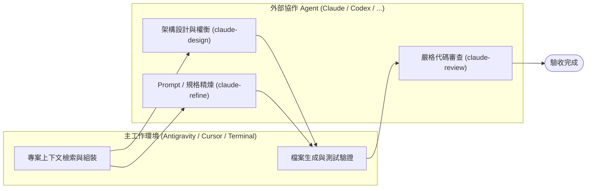
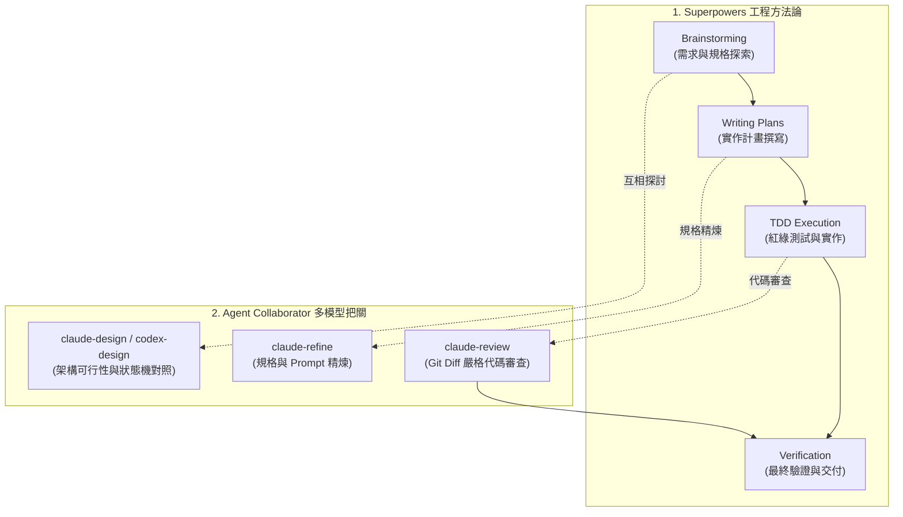

# 🤝 Agent Collaborator (多代理人協同架構 Skill & CLI)

> **Antigravity / Gemini + Claude CLI / Codex / Cursor 多代理人深度協作與交叉驗證系統**
> 具備自動優雅降級（Graceful Fallback）、模組化安裝與 Superpowers 工作流無縫整合。

---

## 🌟 核心理念：為什麼需要多代理人？(Why Multi-Agent / Dual-Agent?)

單一 AI 模型在長鏈條推理中，容易產生**確認偏誤（Confirmation Bias）**與**局部盲區**。

本系統建立了一套**跨模型結對協作模式**：
- **主執行者 (Host Orchestrator - 如 Antigravity / Gemini / Cursor)**：負責全專案上下文感知、跨檔案重構、測試運行與進度推演。
- **外部專家與審查員 (External Reviewer - 如 Claude CLI / Codex)**：負責深層系統架構、邊界條件推演、Prompt 精煉與客觀 Code Review。



---

## ⚡ 核心能力與指令

安裝後，您可以在任何專案或終端機中直接使用以下命令（或由 Agent 自動調用）：

| 指令 / 腳本 | 用途 | 使用範例 |
| :--- | :--- | :--- |
| **`claude-design`** | 系統架構、狀態機、演算法方案對照與深層探索 | `claude-design "<需求描述>" [上下文檔案...]` |
| **`claude-refine`** | Prompt、JSON Schema、規格文件專項精煉優化 | `claude-refine "<目標檔案>" "<優化目標>"` |
| **`claude-review`** | Git Diff 審查、防範 Crash、邏輯漏洞與回歸風險 | `claude-review HEAD "<任務背景描述>"` |
| **`claude-prompt-tune`** | 領域 Prompt 專案調優 | `claude-prompt-tune "<PROMPT檔案>" "<目標>"` |

---

## 🚀 一、 安裝 Superpowers (先備方法論框架)

若您希望讓 Agent 具備完整的工程方法論（規格設計、TDD、實作計畫）：

* **Antigravity**：
  ```bash
  agy plugin install https://github.com/obra/superpowers
  ```
* **Claude Code**：
  ```text
  /plugin install superpowers@claude-plugins-official
  ```
* **Cursor**：
  ```text
  /add-plugin superpowers
  ```

---

## 🚀 二、 安裝 Agent Collaborator

### 1. 取得專案並執行安裝

```bash
git clone https://github.com/gogog22510/agent-collaborator.git
cd agent-collaborator
./install.sh
```

### 2. 選擇安裝模式

```text
======================================================
  🤝 Agent Collaborator Universal Installer
======================================================
Select an installation target:
  1) All (CLI Tools + Antigravity Global + Claude Code Global) [推薦全裝]
  2) Standalone CLI Tools only (~/.local/bin/claude-design, ...)
  3) Antigravity Global Skills (~/.gemini/...)
  4) Project-Local Skill (.agent/skills/ in current directory)
  5) Claude Code Global Skills (~/.claude/skills/)
```

---

## 🌟 三、 Superpowers + Agent Collaborator 黃金流水線

當 Superpowers 結合 Agent Collaborator 時，能形成極高質量的自動化工程閉環：



---

## 📖 各環境配置範本 (Integration Templates)

詳細配置指引請參閱 `templates/` 目錄：
* ⚡ **Superpowers / Antigravity 整合**：[`templates/antigravity_superpowers.md`](templates/antigravity_superpowers.md)
* 🖱️ **Cursor / Windsurf 整合**：[`templates/cursor_rules.md`](templates/cursor_rules.md)
* 🤖 **Claude Code 整合**：[`templates/claude_code.md`](templates/claude_code.md)

---

## 🛡️ 自動優雅降級機制 (Graceful Self-Healing Fallback)

當外部 Agent 遇到 API 額度用盡 (Usage Limit)、Rate Limit (429) 或連線超載 (529) 時，腳本會自動輸出 `⚠️ [FALLBACK_TRIGGERED: ...]`（Exit Code: `100`），主代理人會無縫接管架構或審查工作，**絕不中斷任務流水線**。

---

## 📄 開源授權 (License)

本專案採用 [MIT License](LICENSE) 授權。
