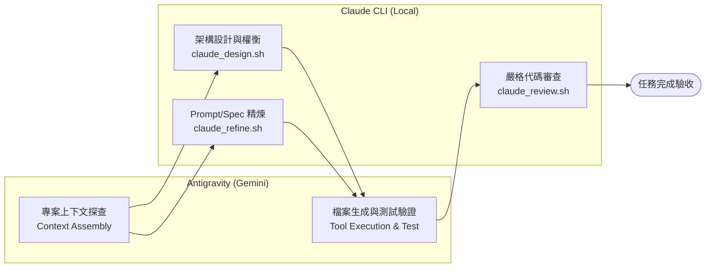

# 🤝 Claude Collaborator (雙代理人協同架構 Skill)

> **Antigravity (Gemini) + Claude CLI 雙代理人深度協作與交叉驗證系統**
> 具備自動優雅降級（Graceful Fallback）與跨語言技術棧支援。

---

## 🌟 核心理念 (Why Dual-Agent?)

單一 AI 模型在複雜工程與長鏈條推理中，容易產生**認知盲區（Blind Spots）**或**確認偏誤（Confirmation Bias）**。

`claude-collaborator` 建立了一套**雙模型協同（Dual-Agent Pair Programming）架構**：
- **Orchestrator & Implementer (Antigravity / Gemini)**：負責全專案上下文檢索、跨檔案重構、工具鏈執行、測試驗收與進度排程。
- **Chief Architect & Reviewer (Claude CLI)**：負責深層架構決策、邊界條件推演、Prompt 精煉與高標準 Code Review。



---

## ⚡ 核心能力與腳本工具

| 腳本 | 用途 | 呼叫方式 |
| :--- | :--- | :--- |
| **`claude_design.sh`** | 架構設計、狀態機、方案對照與深層探索 | `./scripts/claude_design.sh "<需求與目標>" [上下文檔案...]` |
| **`claude_refine.sh`** | Prompt、JSON Schema、規格文件精煉優化 | `./scripts/claude_refine.sh "<目標檔案>" "<優化目標>"` |
| **`claude_review.sh`** | Git Diff 代碼審查、潛在 Crash、邏輯漏洞與回歸預防 | `./scripts/claude_review.sh [BASE_REF] "<任務描述>"` |
| **`claude_prompt_tune.sh`** | 針對特定領域 Prompt 進行專項調整 | `./scripts/claude_prompt_tune.sh "<PROMPT_FILE>" "<目標>"` |

---

## 🛡️ 自動優雅降級機制 (Graceful Self-Healing Fallback)

當本地 `claude` CLI 遇到：
- API 配額用盡 (Usage / Credit Limit)
- 速率限制 (Rate Limit / 429)
- 網路中斷或服務過載 (529 Overloaded)

腳本會自動捕捉異常並輸出 `⚠️ [FALLBACK_TRIGGERED: CLAUDE_UNAVAILABLE]`（Exit Code: `100`），主代理人（Antigravity）會立即接管架構或審查工作，**絕不阻斷任務執行流水線**。

---

## 🚀 快速安裝與設定 (Installation)

### 1. 前置需求
* 本地已安裝並授權 [Claude Code CLI](https://docs.anthropic.com/en/docs/agents-and-tools/claude-code/overview) (`claude`)。
* 具備 Bash 環境（macOS / Linux / Windows WSL）。

### 2. 一鍵安裝

#### 🌐 全域安裝 (Global - 適用於本機所有專案)
```bash
git clone https://github.com/gogog22510/claude-collaborator.git
cd claude-collaborator
./install.sh
# 安裝至 ~/.gemini/config/skills/claude-collaborator
```

#### 📁 專案本地安裝 (Local - 僅限當前專案)
```bash
cd /path/to/your/project
/path/to/claude-collaborator/install.sh --local
# 安裝至 .agent/skills/claude-collaborator
```

---

## 📖 如何在專案中啟用 (Integration)

在專案根目錄的 `AGENTS.md`、`RULES.md` 或系統提示中加入以下約定：

```markdown
## Claude Collaborator Workflow (Dual-Agent Mode)

**Mandatory Rule for Design & Review**: For ANY architectural design, feature planning, prompt/spec tuning, or system exploration:
- **Always proactively consult and discuss with Claude** (`claude-collaborator` skill) to cross-reference designs, explore trade-offs, and validate assumptions before finalizing plans or writing major code.
- Use `claude_design.sh` for architectural/state design, solution comparison, and deep research before writing code.
- Use `claude_refine.sh` for prompts, schemas, specs, or domain documents.
- Use `claude_review.sh` for code review and regression checking before claiming completion of critical tasks.
- If Claude hits usage limits or connection issues, seamlessly follow the self-healing fallback protocol without halting the task.
```

---

## 🌐 跨技術棧自動識別 (Multi-Stack Support)

腳本會自動偵測當前目錄下的專案特徵並注入對應技術棧提示：
* `pubspec.yaml` ➔ **Dart / Flutter**
* `package.json` ➔ **Node.js / TypeScript / JavaScript**
* `Cargo.toml` ➔ **Rust**
* `go.mod` ➔ **Go**
* `pyproject.toml` / `requirements.txt` ➔ **Python**

---

## 📄 開源授權 (License)

本專案採用 [MIT License](LICENSE) 授權。
