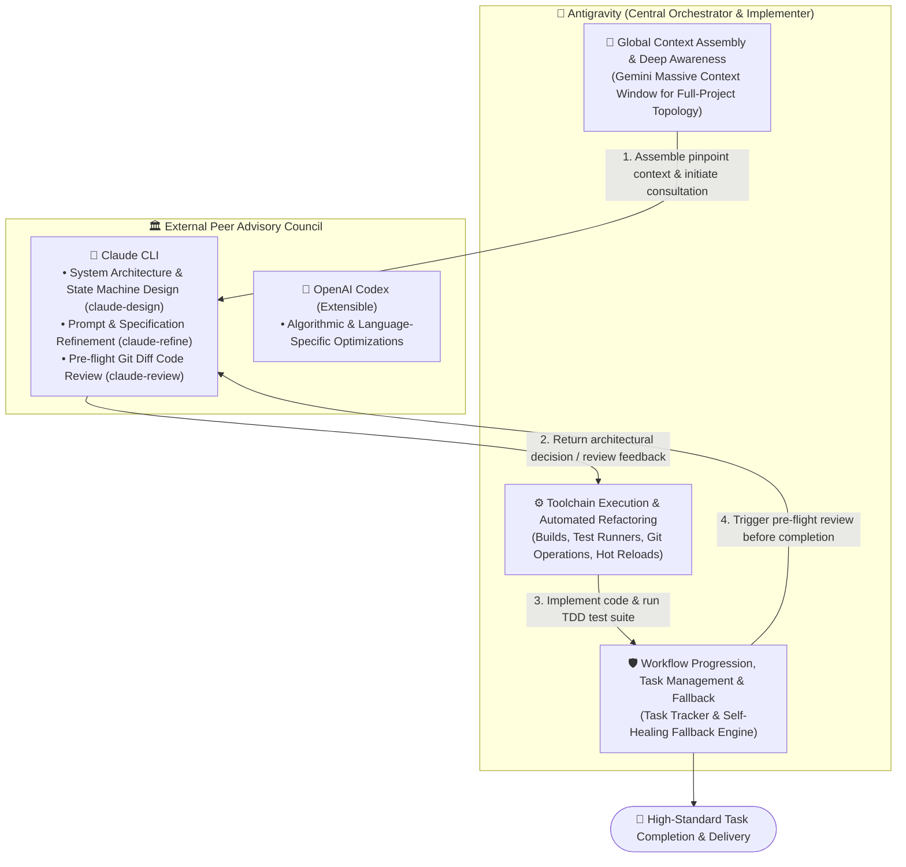
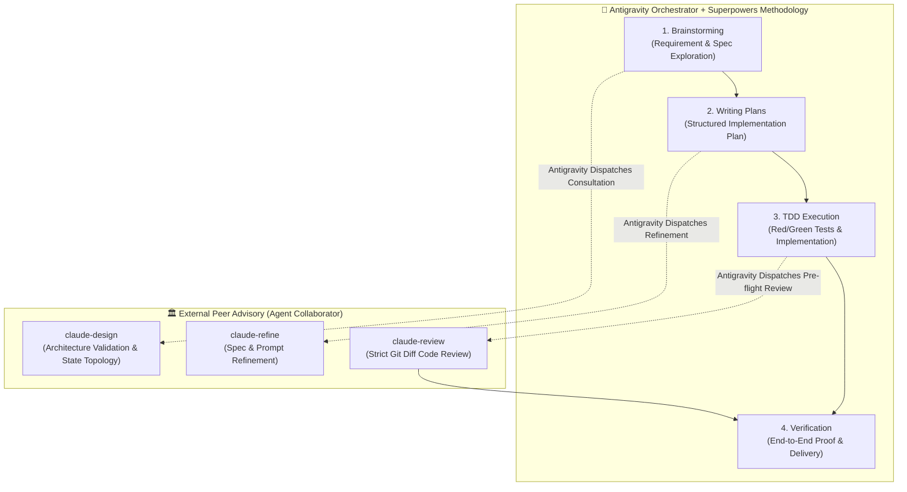

# 🤝 Agent Collaborator

> **A Multi-Agent Peer Collaboration & Cross-Verification System orchestrated by Google Antigravity, dispatching specialized external peer agents (Claude CLI, OpenAI Codex, Cursor) with Automatic Graceful Fallback.**

[](LICENSE)
[](#-architecture-antigravity-as-the-central-orchestrator)
[](#-core-capabilities--cli-tools)
[](#-superpowers--antigravity-pipeline)

[繁體中文說明文件 (Traditional Chinese Document)](README_zh.md)

---

## 🌟 Architecture: Antigravity as the Central Orchestrator

In modern software engineering, a single LLM frequently struggles to balance massive codebase context assembly with rigorous localized logic deduction.

`agent-collaborator` establishes a **Multi-Agent Pair Programming Architecture** where **Google Antigravity (Gemini)** acts as the **Central Orchestrator & Implementer**, proactively consulting and dispatching **External Peer Agents (Claude CLI, OpenAI Codex, etc.)** at critical decision milestones:



### Why Antigravity as the Orchestrator?
1. **Massive Context Capacity**: Antigravity leverages Gemini's industry-leading context window and whole-project search capabilities to assemble precise, comprehensive code slices for external advisors.
2. **Full Toolchain Authority**: Antigravity natively manages terminal command execution, test suite verification, file manipulation, and version control.
3. **Active Coordination & Fault Tolerance**: Antigravity maintains task trackers and execution state. When an external peer agent encounters rate limits, token exhaustion, or connection hiccups, Antigravity seamlessly assumes the role to ensure the workflow never blocks.

---

## ⚡ Core Capabilities & CLI Tools

Once installed, you can use these tools directly in any terminal or allow Antigravity to automatically orchestrate them:

| Command / Script | Purpose | Usage Example |
| :--- | :--- | :--- |
| **`claude-design`** | System architecture, state machines, trade-off analysis & research | `claude-design "<requirement>" [context_files...]` |
| **`claude-refine`** | Spec optimization, JSON Schema refinement & prompt tuning | `claude-refine "<target_file>" "<optimization_goal>"` |
| **`claude-review`** | Objective Git Diff code review, crash prevention & regression check | `claude-review HEAD "<task_context_description>"` |

---

## 🚀 1. Install Superpowers (Prerequisite Methodology)

If you want your agent to follow structured engineering discipline (Brainstorming, Spec First, Implementation Plans, Red/Green TDD):

* **Antigravity**:
  ```bash
  agy plugin install https://github.com/obra/superpowers
  ```
* **Claude Code**:
  ```text
  /plugin install superpowers@claude-plugins-official
  ```
* **Cursor**:
  ```text
  /add-plugin superpowers
  ```

---

## 🚀 2. Install Agent Collaborator

### Step 1: Clone Repository
```bash
git clone https://github.com/gogog22510/agent-collaborator.git
cd agent-collaborator
./install.sh
```

### Step 2: Choose Installation Mode

```text
======================================================
  🤝 Agent Collaborator Universal Installer
======================================================
Select an installation target:
  1) All (CLI Tools + Antigravity Global + Claude Code Global) [Recommended]
  2) Standalone CLI Tools only (~/.local/bin/claude-design, ...)
  3) Antigravity Global Skills (~/.gemini/...)
  4) Project-Local Skill (.agent/skills/ in current directory)
  5) Claude Code Global Skills (~/.claude/skills/)
```

### Non-Interactive Flags (CI / Automated Scripts)
* **Full Install**: `./install.sh --all`
* **CLI Only**: `./install.sh --cli` (Symlinks to `~/.local/bin/`)
* **Antigravity Global**: `./install.sh --antigravity-global` (Installs into `~/.gemini/skills/`)
* **Project Local**: `./install.sh --project /path/to/project` (Installs into `.agent/skills/`)

---

## 🌟 3. Superpowers + Antigravity Orchestration Pipeline

When combining Superpowers methodology with Antigravity and Agent Collaborator, every engineering milestone is double-checked by peer models:



---

## 📖 Environment Integration Templates

Ready-to-use integration contracts are available in the `templates/` directory:
* ⚡ **Superpowers / Antigravity**: [`templates/antigravity_superpowers.md`](templates/antigravity_superpowers.md) (Add to `.agent/AGENTS.md`)
* 🖱️ **Cursor / Windsurf**: [`templates/cursor_rules.md`](templates/cursor_rules.md) (Add to `.cursorrules`)
* 🤖 **Claude Code**: [`templates/claude_code.md`](templates/claude_code.md) (Add to `CLAUDE.md`)

---

## 🛡️ Graceful Self-Healing Fallback

When an external peer agent encounters:
- Usage / Credit limits
- Rate limits (429)
- Server overload (529)

The helper scripts automatically catch the error, emit `⚠️ [FALLBACK_TRIGGERED: ...]`, and exit with code `100`. The Orchestrator (Antigravity) seamlessly takes over reasoning internally, **ensuring tasks never stall**.

---

## 🌐 Multi-Stack Auto Detection

The scripts automatically detect project configurations and tailor the prompt context:
* `pubspec.yaml` ➔ **Dart / Flutter**
* `package.json` ➔ **Node.js / TypeScript / JavaScript**
* `Cargo.toml` ➔ **Rust**
* `go.mod` ➔ **Go**
* `pyproject.toml` / `requirements.txt` ➔ **Python**

---

## 📄 License

Distributed under the [MIT License](LICENSE).
