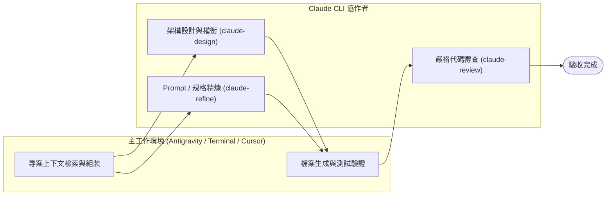

# 🤝 Claude Collaborator (雙代理人協同架構 Skill & CLI)

> **Antigravity / Gemini + Claude CLI 雙代理人深度協作與交叉驗證系統**
> 具備自動優雅降級（Graceful Fallback）、模組化安裝與跨平台技術棧支援。

---

## 🧩 概念解構：與 Antigravity / Superpowers 的關係

很多開發者初次接觸時會好奇它與其他工具的關係：

* **Antigravity**：Google 的新一代 Agentic AI 編程環境（支援全專案檢索、工具鏈執行與自回歸推演）。
* **Superpowers**：為 Coding Agents 設計的一套結構化工作流（包含 Planning、單流執行與嚴格驗證紀律）。
* **Claude Collaborator（本專案）**：一個**完全獨立、解耦的雙代理人協同引擎（Skill & CLI）**。
  * 它**不強制綁定**任何特定框架；
  * 它可以作為 **純命令列工具（CLI）** 供工程師直接在 Terminal 使用；
  * 也可以作為 **Skill 模組** 載入至 **Antigravity**、**Superpowers**、**Claude Code** 或 **Cursor**。

---

## 🌟 核心價值：為什麼需要雙代理人？(Why Dual-Agent?)

單一 AI 模型在長鏈條推理中，容易產生**確認偏誤（Confirmation Bias）**與**局部盲區**。

本系統建立了一套**雙模型結對協作模式**：
- **主執行者 (Orchestrator - 如 Antigravity / Gemini / Cursor)**：負責全專案上下文感知、跨檔案重構、測試運行與進度推演。
- **首席架構與審查員 (Chief Reviewer - Claude CLI)**：負責深層系統架構、邊界條件推演、Prompt 精煉與客觀 Code Review。



---

## ⚡ 核心能力與指令

安裝後，您可以在任何專案或終端機中直接使用以下命令（或由 Agent 調用）：

| 指令 / 腳本 | 用途 | 使用範例 |
| :--- | :--- | :--- |
| **`claude-design`** | 系統架構、狀態機、演算法方案對照與深層探索 | `claude-design "<需求描述>" [上下文檔案...]` |
| **`claude-refine`** | Prompt、JSON Schema、規格文件專項精煉優化 | `claude-refine "<目標檔案>" "<優化目標>"` |
| **`claude-review`** | Git Diff 審查、防範 Crash、邏輯漏洞與回歸風險 | `claude-review HEAD "<任務背景描述>"` |
| **`claude-prompt-tune`** | 領域 Prompt 專案調優 | `claude-prompt-tune "<PROMPT檔案>" "<目標>"` |

---

## 🛡️ 自動優雅降級機制 (Graceful Self-Healing Fallback)

當本地 `claude` CLI 遇到：
- API 配額用盡 (Usage / Credit Limit)
- 速率限制 (Rate Limit / 429)
- 網路中斷或服務過載 (529 Overloaded)

腳本會自動捕捉異常並輸出 `⚠️ [FALLBACK_TRIGGERED: CLAUDE_UNAVAILABLE]`（Exit Code: `100`），主代理人（Antigravity）會立即接管架構或審查工作，**絕不阻斷任務執行流水線**。

---

## 🚀 模組化一鍵安裝 (Modular Installation)

### 1. 前置需求
* 本地已安裝並完成登入授權的 [Claude Code CLI](https://docs.anthropic.com/en/docs/agents-and-tools/claude-code/overview) (`claude`)。

### 2. 執行安裝

```bash
git clone https://github.com/gogog22510/claude-collaborator.git
cd claude-collaborator
./install.sh
```

執行後會出現互動式選單，您可以依使用習慣選擇：

```text
======================================================
  🤝 Claude Collaborator Universal Installer
======================================================
Select an installation target:
  1) All (CLI Tools + Antigravity Global + Claude Code Global) [Recommended]
  2) Standalone CLI Tools only (~/.local/bin/claude-design, ...)
  3) Antigravity Global Skills (~/.gemini/...)
  4) Project-Local Skill (.agent/skills/ in current directory)
  5) Claude Code Global Skills (~/.claude/skills/)
```

### 3. 非互動式參數（CI / Script 適用）

* **全裝推薦**：`./install.sh --all`
* **僅終端機 CLI**：`./install.sh --cli`（連結至 `~/.local/bin`）
* **Antigravity 全域**：`./install.sh --antigravity-global`（裝入 `~/.gemini/skills/`）
* **指定專案本地**：`./install.sh --project /path/to/project`（裝入該專案的 `.agent/skills/`）

---

## 📖 各環境配置範本 (Integration Templates)

本專案提供多種環境的整合範本（位於 `templates/`）：

1. **Antigravity / Superpowers**：參考 [`templates/antigravity_superpowers.md`](templates/antigravity_superpowers.md)，加入專案的 `AGENTS.md`。
2. **Cursor / Windsurf**：參考 [`templates/cursor_rules.md`](templates/cursor_rules.md)，貼入 `.cursorrules`。
3. **Claude Code**：參考 [`templates/claude_code.md`](templates/claude_code.md)，貼入 `CLAUDE.md`。

---

## 🌐 跨技術棧自動識別 (Multi-Stack Support)

腳本會自動偵測當前目錄下的專案特徵並注入對應技術棧提示：
* `pubspec.yaml` ➔ **Dart / Flutter**
* `package.json` ➔ **Node.js / TypeScript / JavaScript**
* `Cargo.toml` ➔ **Rust**
* `go.mod` ➔ **Go**
* `pyproject.toml` / `requirements.txt` ➔ **Python**

---

## 📄 開源授權 (License)

本專案採用 [MIT License](LICENSE) 授權。
