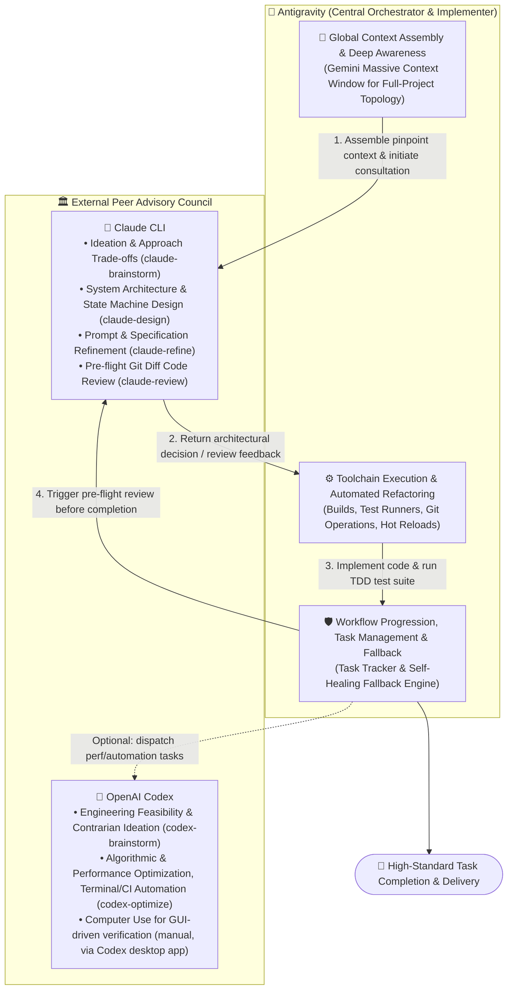
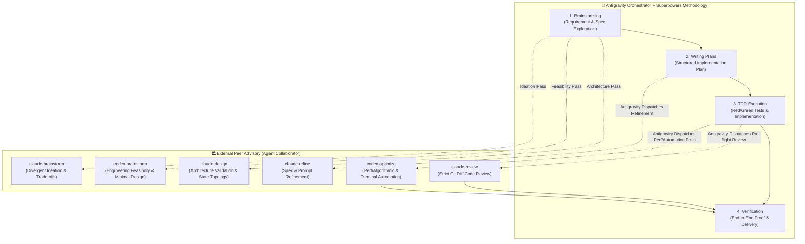

# 🤝 Agent Collaborator

> **A Multi-Agent Peer Collaboration & Cross-Verification System orchestrated by Google Antigravity, dispatching specialized external peer agents (Claude CLI, OpenAI Codex, Cursor) with Automatic Graceful Fallback.**

[](LICENSE)
[](#-architecture-antigravity-as-the-central-orchestrator)
[](#-core-capabilities--cli-tools)
[](#-superpowers--antigravity-pipeline)

[繁體中文說明文件 (Traditional Chinese Document)](README_zh.md)

---

## 🌟 Architecture: Antigravity as the Central Orchestrator

In modern software engineering, a single LLM frequently struggles to balance massive codebase context assembly with rigorous localized logic deduction.

`agent-collaborator` establishes a **Multi-Agent Pair Programming Architecture** where **Google Antigravity (Gemini)** acts as the **Central Orchestrator & Implementer**, proactively consulting and dispatching **External Peer Agents (Claude CLI, OpenAI Codex, etc.)** at critical decision milestones:



### Why Antigravity as the Orchestrator?
1. **Massive Context Capacity**: Antigravity leverages Gemini's industry-leading context window and whole-project search capabilities to assemble precise, comprehensive code slices for external advisors.
2. **Full Toolchain Authority**: Antigravity natively manages terminal command execution, test suite verification, file manipulation, and version control.
3. **Active Coordination & Fault Tolerance**: Antigravity maintains task trackers and execution state. When an external peer agent encounters rate limits, token exhaustion, or connection hiccups, Antigravity seamlessly assumes the role to ensure the workflow never blocks.

---

## ⚡ Core Capabilities & CLI Tools

Once installed, you can use these tools directly in any terminal or allow Antigravity to automatically orchestrate them:

| Command / Script | Purpose | Usage Example |
| :--- | :--- | :--- |
| **`claude-brainstorm`** | Divergent ideation, 2-3 distinct approaches, trade-offs & edge cases | `claude-brainstorm "<requirement>" [context_files...]` |
| **`codex-brainstorm`** | Engineering feasibility, ecosystem/standard library alternatives & contrarian pass | `codex-brainstorm "<requirement>" [context_files...]` |
| **`claude-design`** | System architecture, state machines, component API boundaries & research | `claude-design "<requirement>" [context_files...]` |
| **`claude-refine`** | Spec optimization, JSON Schema refinement & prompt tuning | `claude-refine "<target_file>" "<optimization_goal>"` |
| **`claude-review`** | Objective Git Diff code review, crash prevention & regression check | `claude-review HEAD "<task_context_description>"` |
| **`codex-optimize`** | Algorithmic complexity/performance analysis & terminal/CI automation | `codex-optimize "<task_or_requirement>" [context_files...]` |

---

## 🧩 Claude CLI vs. OpenAI Codex: Picking the Right Peer

Both are genuine coding agents; each is dispatched here for what it's actually best at:

| Strength | Claude CLI | OpenAI Codex |
| :--- | :--- | :--- |
| Divergent brainstorming & approach trade-offs | ✅ Primary (`claude-brainstorm`) | — |
| Engineering feasibility & minimal viable architecture | — | ✅ Primary (`codex-brainstorm`) |
| Deep architecture / long-context reasoning across many files | ✅ Primary (`claude-design`) | — |
| Rigorous, security-minded code review | ✅ Primary (`claude-review`) | — |
| Spec / prompt / schema refinement | ✅ Primary (`claude-refine`) | — |
| Terminal, shell & CI pipeline automation | — | ✅ Leads (Terminal-Bench-style benchmarks) |
| Algorithmic / performance-hotspot optimization | — | ✅ Primary (`codex-optimize`) |
| Cost-per-task on high-volume, terminal-heavy work | — | ✅ Typically fewer tokens per task |
| **Computer Use** — seeing the screen and driving mouse/keyboard to operate real GUI apps (browser, Figma, Xcode, Slack, etc.) | — | ✅ Native, but only via the **Codex desktop/ChatGPT app**, not the headless CLI |

Computer Use is genuinely one of Codex's strengths, but it is an interactive, screen-driven capability — this repo's scripts are all non-interactive/headless (`codex exec`), so `codex-optimize` cannot drive a GUI. When a task truly needs visual/GUI verification (e.g. "does this actually render correctly in Figma/the browser?"), the orchestrator should say so explicitly and hand that step to a human (or the Codex desktop app) rather than pretending a headless script can do it.

---

## 🔄 Dual Operating Modes: Standalone vs. Superpowers Integrated

Agent Collaborator is designed with **adaptive dual-mode compatibility**:

1. **Standalone Mode (Default / Bare Agent Collaborator)**:
   - Run without installing Superpowers (`./install.sh --all` or `./install.sh --project <path>`).
   - Focuses purely on multi-model advisory and pre-flight verification (`claude-design`, `claude-review`, `claude-refine`, `codex-optimize`).
   - The Central Orchestrator uses its internal reasoning and standard planning. It **never fails, errors, or requires missing skills** if Superpowers is absent.
2. **Superpowers Integrated Mode (Dual-Engine Powerhouse)**:
   - Combines Superpowers' structured engineering lifecycle (Brainstorming, Spec-First, Red/Green TDD, Systematic Debugging, Verification) with Agent Collaborator's peer advisory council.
   - Run with `./install.sh --with-superpowers` (or install the plugin manually).
   - **How it is technically guaranteed**:
     - **Claude Code**: The `superpowers` `SessionStart` hook injects mandatory skill invocation rules on startup.
     - **Antigravity (Gemini)**: The protocol in `AGENTS.md` and `GEMINI.md` acts as an **Always-Active Rule**, unconditionally enforcing engineering discipline on every engineering turn.
3. **Trigger Boundary (Engineering Tasks vs. Informational Q&A)**:
   - **Active Engineering Tasks** (writing code, designing components, fixing bugs, refactoring) strictly enforce Superpowers and Peer Review.
   - **Informational Q&A** (e.g. *"What does line 42 do?"*, *"Explain this architecture"*, *"How to write this Dart syntax?"*) are **explicitly exempt** from workflow ceremonies and answered directly without friction.

---

## 🚀 1. Install Superpowers (Optional Dual-Engine Methodology)

If you want your agent to follow structured engineering discipline (Brainstorming, Spec First, Implementation Plans, Red/Green TDD), `install.sh` can install it for you:

```bash
./install.sh --with-superpowers
```

This detects whichever driver CLI is on `PATH` (`agy` for Antigravity, `claude` for Claude Code) and runs its non-interactive plugin-install command. It can be combined with any other flag, e.g. `./install.sh --project . --with-superpowers`.

If installing manually:
* **Antigravity**:
  ```bash
  agy plugin install https://github.com/obra/superpowers
  ```
* **Claude Code** (inside a Claude Code session):
  ```text
  /plugin install superpowers@claude-plugins-official
  ```
* **Cursor**:
  ```text
  /add-plugin superpowers
  ```

---

## 🚀 2. Install Agent Collaborator

### Step 1: Clone Repository
```bash
git clone https://github.com/gogog22510/agent-collaborator.git
cd agent-collaborator
./install.sh
```

### Step 2: Choose Installation Mode

```text
======================================================
  🤝 Agent Collaborator Universal Installer
======================================================
Select an installation target:
  1) All (CLI Tools + Antigravity Global + Claude Code Global) [Recommended]
  2) Standalone CLI Tools only (~/.local/bin/claude-design, ...)
  3) Antigravity Global Skills (~/.gemini/...)
  4) Project-Local Skill (.agent/skills/ in current directory)
  5) Claude Code Global Skills (~/.claude/skills/)
  6) Install Superpowers methodology plugin (Antigravity / Claude Code)
```

### Non-Interactive Flags (CI / Automated Scripts)
* **Full Install**: `./install.sh --all`
* **CLI Only**: `./install.sh --cli` (Symlinks to `~/.local/bin/`)
* **Antigravity Global**: `./install.sh --antigravity-global` (Installs into `~/.gemini/skills/` and updates `~/.gemini/config/AGENTS.md`)
* **Project Local**: `./install.sh --project /path/to/project` (Installs into `.agent/skills/` and `.claude/skills/`, and injects/updates the protocol in `/path/to/project/AGENTS.md` — pass `--no-agents-md` to skip protocol injection)
* **With Superpowers**: `./install.sh --with-superpowers` (standalone, or combined with any flag above)

> **In-Place Updates**: `--project` safely injects or updates the protocol block between `<!-- agent-collaborator:protocol:start -->` and `<!-- agent-collaborator:protocol:end -->` in-place, preserving any custom rules you already have in `AGENTS.md`. It also cleans up any legacy duplicate Superpowers skills in `.agent/skills/` to ensure your global plugin works cleanly without version drift.

---

## 🌟 3. Superpowers + Antigravity Orchestration Pipeline

When combining Superpowers methodology with Antigravity and Agent Collaborator, every engineering milestone is double-checked by peer models:



---

## 📖 Environment Integration Templates

Ready-to-use integration contracts are available in the `templates/` directory:
* ⚡ **Superpowers / Antigravity**: [`templates/antigravity_superpowers.md`](templates/antigravity_superpowers.md) (Add to `.agent/AGENTS.md`)
* 🖱️ **Cursor / Windsurf**: [`templates/cursor_rules.md`](templates/cursor_rules.md) (Add to `.cursorrules`)
* 🤖 **Claude Code**: [`templates/claude_code.md`](templates/claude_code.md) (Add to `CLAUDE.md`)

---

## 🛡️ Graceful Self-Healing Fallback

### Antigravity Sandbox Handling
External peer agent tools (`claude-design`, `claude-refine`, `claude-review`) execute host binaries (`~/.local/bin/claude`) and require outbound internet access to the Claude API.
- **`BypassSandbox: true` Requirement**: When Antigravity calls these tools via `run_command`, it must set `BypassSandbox: true`.
- **Sandbox Isolation Error (Exit 126)**: If the command is mistakenly executed inside standard sandbox mode, it returns `❌ [SANDBOX_BLOCKED] (Exit: 126)`. The orchestrator will NOT fall back, and will immediately re-run with `BypassSandbox: true`.

### True API Limit / Outage Fallback (Exit 100)
When an external peer agent encounters:
- Usage / Credit limits
- Rate limits (429)
- Server overload (529)

The helper scripts automatically catch the error, emit `⚠️ [FALLBACK_TRIGGERED: ...]`, and exit with code `100`. The Orchestrator (Antigravity) seamlessly takes over reasoning internally, **ensuring tasks never stall**.

---

## 🌐 Multi-Stack Auto Detection

The scripts automatically detect project configurations and tailor the prompt context:
* `pubspec.yaml` ➔ **Dart / Flutter**
* `package.json` ➔ **Node.js / TypeScript / JavaScript**
* `Cargo.toml` ➔ **Rust**
* `go.mod` ➔ **Go**
* `pyproject.toml` / `requirements.txt` ➔ **Python**

---

## 📄 License

Distributed under the [MIT License](LICENSE).
