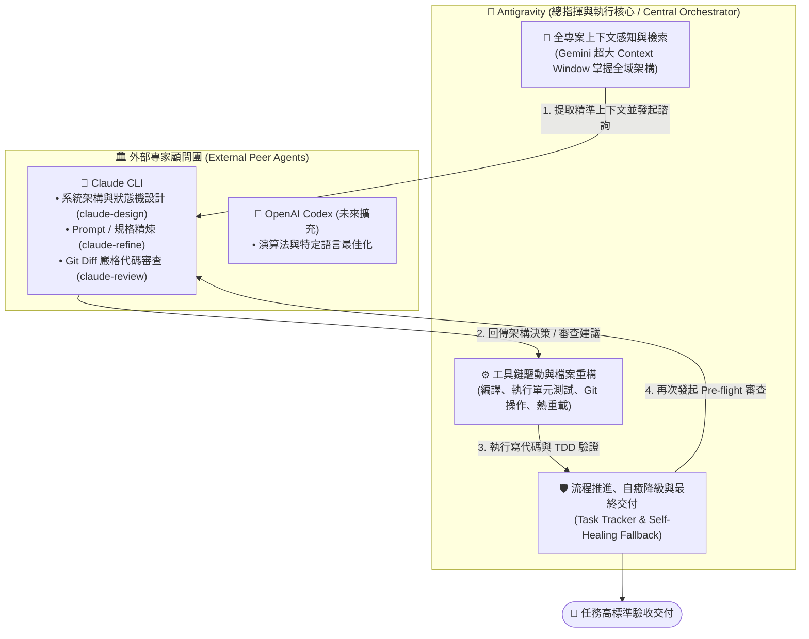
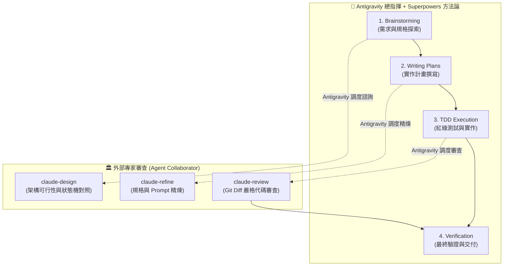

# 🤝 Agent Collaborator (多代理人協同架構 Skill & CLI)

> **以 Antigravity 作為總指揮核心（Central Orchestrator），調度 Claude CLI / Codex / Cursor 外部專家的多代理人深度協作與交叉驗證系統。**
> 具備自動優雅降級（Graceful Fallback）、模組化安裝與 Superpowers 工作流無縫整合。

[English Documentation](README.md)

---

## 🌟 核心分工：Antigravity 作為總指揮 (Orchestrator Architecture)

在現代軟體工程中，單一模型往往難以同時兼顧「全域專案感知」與「嚴苛的局部邏輯推理」。

`agent-collaborator` 的核心架構是由 **Google Antigravity (Gemini)** 擔任**總指揮官與主執行者（Central Orchestrator & Implementer）**，並在關鍵決策節點主動調度 **Claude CLI / Codex 等外部專家（Peer Experts）**：



### 為什麼由 Antigravity 擔任總指揮？
1. **龐大的上下文吞吐量（Context Capacity）**：Antigravity 具備強大的全專案跨檔案檢索與上下文組裝能力，能精確為外部專家準備最相關的程式碼切片。
2. **完整的工具鏈執行權限（Toolchain Orchestration）**：Antigravity 原生支援終端命令執行、測試套件驗收、檔案增刪與版本控制。
3. **主動協調與容錯能力（Active Coordination & Fallback）**：Antigravity 負責維護任務清單與推進狀態，當外部專家 API 額度用盡或連線異常時，Antigravity 會自動無縫接管，確保工作流永不中斷。

---

## ⚡ 核心能力與指令

安裝後，您可以直接在終端機使用（或由 Antigravity 自動調度調用）：

| 指令 / 腳本 | 用途 | 使用範例 |
| :--- | :--- | :--- |
| **`claude-design`** | 系統架構、狀態機、演算法方案對照與深層探索 | `claude-design "<需求描述>" [上下文檔案...]` |
| **`claude-refine`** | Prompt、JSON Schema、規格文件專項精煉優化 | `claude-refine "<目標檔案>" "<優化目標>"` |
| **`claude-review`** | Git Diff 審查、防範 Crash、邏輯漏洞與回歸風險 | `claude-review HEAD "<任務背景描述>"` |
| **`claude-prompt-tune`** | 領域 Prompt 專案調優 | `claude-prompt-tune "<PROMPT檔案>" "<目標>"` |

---

## 🚀 一、 安裝 Superpowers (先備方法論框架)

若您希望讓 Agent 具備完整的工程方法論（規格設計、TDD、實作計畫）：

* **Antigravity**：
  ```bash
  agy plugin install https://github.com/obra/superpowers
  ```
* **Claude Code**：
  ```text
  /plugin install superpowers@claude-plugins-official
  ```
* **Cursor**：
  ```text
  /add-plugin superpowers
  ```

---

## 🚀 二、 安裝 Agent Collaborator

### 1. 取得專案並執行安裝

```bash
git clone https://github.com/gogog22510/agent-collaborator.git
cd agent-collaborator
./install.sh
```

### 2. 選擇安裝模式

```text
======================================================
  🤝 Agent Collaborator Universal Installer
======================================================
Select an installation target:
  1) All (CLI Tools + Antigravity Global + Claude Code Global) [推薦全裝]
  2) Standalone CLI Tools only (~/.local/bin/claude-design, ...)
  3) Antigravity Global Skills (~/.gemini/...)
  4) Project-Local Skill (.agent/skills/ in current directory)
  5) Claude Code Global Skills (~/.claude/skills/)
```

---

## 🌟 三、 Superpowers + Antigravity 總指揮流水線

當 Superpowers 結合 Antigravity + Agent Collaborator 時，每個階段都能達成雙模型把關：



---

## 📖 各環境配置範本 (Integration Templates)

詳細配置指引請參閱 `templates/` 目錄：
* ⚡ **Superpowers / Antigravity 整合**：[`templates/antigravity_superpowers.md`](templates/antigravity_superpowers.md)
* 🖱️ **Cursor / Windsurf 整合**：[`templates/cursor_rules.md`](templates/cursor_rules.md)
* 🤖 **Claude Code 整合**：[`templates/claude_code.md`](templates/claude_code.md)

---

## 🛡️ 自動優雅降級機制 (Graceful Self-Healing Fallback)

當外部 Agent 遇到 API 額度用盡 (Usage Limit)、Rate Limit (429) 或連線超載 (529) 時，腳本會自動輸出 `⚠️ [FALLBACK_TRIGGERED: ...]`（Exit Code: `100`），總指揮（Antigravity）會無縫接管架構或審查工作，**絕不中斷任務流水線**。

---

## 📄 開源授權 (License)

本專案採用 [MIT License](LICENSE) 授權。
