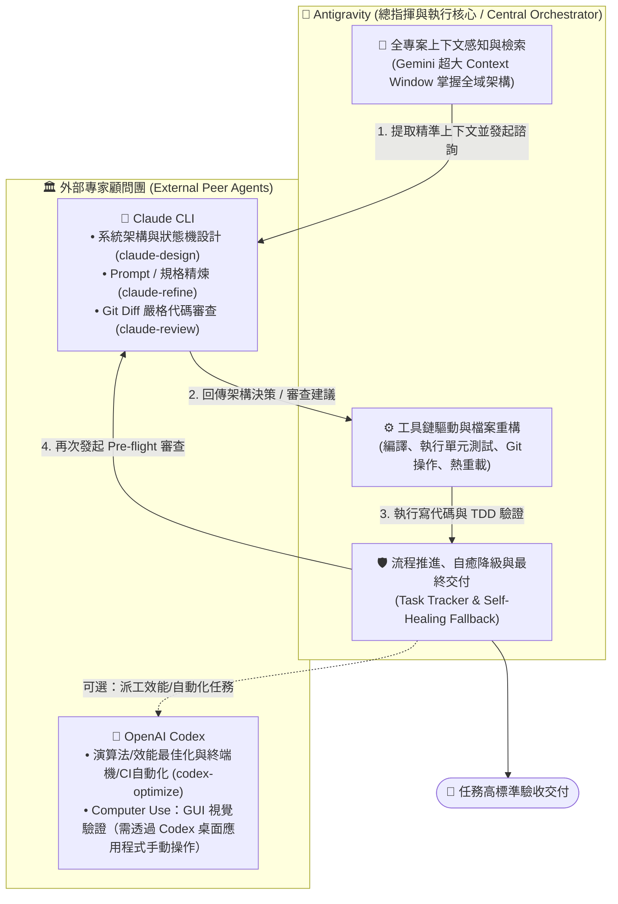
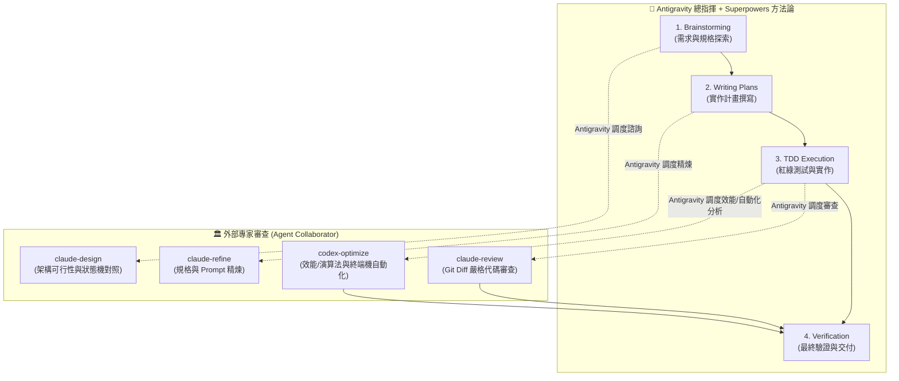

# 🤝 Agent Collaborator (多代理人協同架構 Skill & CLI)

> **以 Antigravity 作為總指揮核心（Central Orchestrator），調度 Claude CLI / Codex / Cursor 外部專家的多代理人深度協作與交叉驗證系統。**
> 具備自動優雅降級（Graceful Fallback）、模組化安裝與 Superpowers 工作流無縫整合。

[English Documentation](README.md)

---

## 🌟 核心分工：Antigravity 作為總指揮 (Orchestrator Architecture)

在現代軟體工程中，單一模型往往難以同時兼顧「全域專案感知」與「嚴苛的局部邏輯推理」。

`agent-collaborator` 的核心架構是由 **Google Antigravity (Gemini)** 擔任**總指揮官與主執行者（Central Orchestrator & Implementer）**，並在關鍵決策節點主動調度 **Claude CLI / Codex 等外部專家（Peer Experts）**：



### 為什麼由 Antigravity 擔任總指揮？
1. **龐大的上下文吞吐量（Context Capacity）**：Antigravity 具備強大的全專案跨檔案檢索與上下文組裝能力，能精確為外部專家準備最相關的程式碼切片。
2. **完整的工具鏈執行權限（Toolchain Orchestration）**：Antigravity 原生支援終端命令執行、測試套件驗收、檔案增刪與版本控制。
3. **主動協調與容錯能力（Active Coordination & Fallback）**：Antigravity 負責維護任務清單與推進狀態，當外部專家 API 額度用盡或連線異常時，Antigravity 會自動無縫接管，確保工作流永不中斷。

---

## ⚡ 核心能力與指令

安裝後，您可以直接在終端機使用（或由 Antigravity 自動調度調用）：

| 指令 / 腳本 | 用途 | 使用範例 |
| :--- | :--- | :--- |
| **`claude-design`** | 系統架構、狀態機、演算法方案對照與深層探索 | `claude-design "<需求描述>" [上下文檔案...]` |
| **`claude-refine`** | Prompt、JSON Schema、規格文件專項精煉優化 | `claude-refine "<目標檔案>" "<優化目標>"` |
| **`claude-review`** | Git Diff 審查、防範 Crash、邏輯漏洞與回歸風險 | `claude-review HEAD "<任務背景描述>"` |
| **`codex-optimize`** | 演算法複雜度/效能瓶頸分析、終端機與 CI 自動化 | `codex-optimize "<任務或需求>" [上下文檔案...]` |

---

## 🧩 Claude CLI 與 OpenAI Codex：如何選擇

兩者都是真正能寫代碼的 Agent，本專案依各自實際強項分派任務：

| 強項 | Claude CLI | OpenAI Codex |
| :--- | :--- | :--- |
| 跨檔案深度架構 / 長上下文推理 | ✅ 主力 | — |
| 嚴謹、重視安全性的代碼審查 | ✅ 主力 | — |
| 規格 / Prompt / Schema 精煉 | ✅ 主力 | — |
| 終端機、Shell 與 CI Pipeline 自動化 | — | ✅ 領先（Terminal-Bench 類基準表現佳）|
| 演算法 / 效能瓶頸最佳化 | — | ✅ 主力（`codex-optimize`）|
| 大量、終端機導向任務的單次成本 | — | ✅ 通常耗用 Token 更少 |
| **Computer Use**：透過螢幕感知與滑鼠/鍵盤操作真實 GUI 應用（瀏覽器、Figma、Xcode、Slack 等）| — | ✅ 原生支援，但僅限 **Codex 桌面 / ChatGPT 應用程式**，非無頭 CLI |

Computer Use 確實是 Codex 的真實強項之一，但它是互動式、依賴螢幕操作的能力——本專案的腳本皆為非互動 / 無頭模式 (`codex exec`)，因此 `codex-optimize` 無法驅動 GUI。當任務真的需要視覺 / GUI 驗證時（例如「這個變更在 Figma / 瀏覽器裡實際渲染是否正確？」），總指揮應明確說明，並交由人類操作員或 Codex 桌面應用程式處理，而非假裝無頭腳本能夠完成。

---

## 🔄 雙模態運作支援：獨立模式 vs Superpowers 整合模式

Agent Collaborator 具備**自適應雙模態相容設計**：

1. **獨立模式（預設 / Standalone Mode）**：
   - 無需安裝 Superpowers 即可獨立運作（執行 `./install.sh --all` 或 `./install.sh --project <path>`）。
   - 專注於多模型專家智囊審查與交付前驗證（`claude-design`, `claude-review`, `claude-refine`, `codex-optimize`）。
   - 總指揮採用原生內建推理進行標準計畫與除錯。**若環境沒有安裝 Superpowers，系統絕不會報錯或中斷任務**。
2. **Superpowers 整合模式（雙引擎架構 / Dual-Engine）**：
   - 將 Superpowers 的嚴格工程生命週期（頭腦風暴、規格先行、TDD 先紅後綠、系統性除錯、交付前驗證）與 Agent Collaborator 外部 Peer 智囊團完美結合。
   - 執行 `./install.sh --with-superpowers`（或手動安裝外掛）即可啟用。
   - **技術保證機制**：
     - **Claude Code**：透過 `superpowers` 外掛的 `SessionStart` Hook，在會話啟動時硬性注入技能調用約束。
     - **Antigravity (Gemini)**：透過 `AGENTS.md` / `GEMINI.md` 的 **常駐系統規則（Always-Active Rules）**，每一輪工程決策皆強制遵守。
3. **任務邊界定義（工程任務 vs 純資訊問答）**：
   - **實質工程任務**（撰寫/修改程式碼、設計功能、修復 Bug、重構）：嚴格強制執行 Superpowers 與 Peer Review。
   - **純資訊與概念問答**（例如：*「這行 code 是什麼意思？」*、*「介紹一下專案架構」*、*「Dart 語法怎麼寫？」*）：**明確予以豁免**，直接精準回覆，不觸發繁瑣流程。

---

## 🚀 一、 安裝 Superpowers (可選雙引擎方法論框架)

若您希望讓 Agent 具備完整的工程方法論（規格設計、TDD、實作計畫），`install.sh` 可以幫您自動安裝：

```bash
./install.sh --with-superpowers
```

此指令會偵測 `PATH` 上有哪個驅動 CLI（Antigravity 用 `agy`，Claude Code 用 `claude`），並執行其外掛安裝指令；可與其他任何選項組合，例如 `./install.sh --project . --with-superpowers`。

若手動安裝：
* **Antigravity**：
  ```bash
  agy plugin install https://github.com/obra/superpowers
  ```
* **Claude Code**（需在 Claude Code session 內執行）：
  ```text
  /plugin install superpowers@claude-plugins-official
  ```
* **Cursor**：
  ```text
  /add-plugin superpowers
  ```

---

## 🚀 二、 安裝 Agent Collaborator

### 1. 取得專案並執行安裝

```bash
git clone https://github.com/gogog22510/agent-collaborator.git
cd agent-collaborator
./install.sh
```

### 2. 選擇安裝模式

```text
======================================================
  🤝 Agent Collaborator Universal Installer
======================================================
Select an installation target:
  1) All (CLI Tools + Antigravity Global + Claude Code Global) [推薦全裝]
  2) Standalone CLI Tools only (~/.local/bin/claude-design, ...)
  3) Antigravity Global Skills (~/.gemini/...)
  4) Project-Local Skill (.agent/skills/ in current directory)
  5) Claude Code Global Skills (~/.claude/skills/)
  6) Install Superpowers methodology plugin (Antigravity / Claude Code)
```

### 非互動旗標（CI / 自動化腳本）
* **全裝**：`./install.sh --all`
* **僅 CLI**：`./install.sh --cli`（symlink 到 `~/.local/bin/`）
* **Antigravity Global**：`./install.sh --antigravity-global`（安裝至 `~/.gemini/skills/` 並同步 `~/.gemini/config/AGENTS.md`）
* **Project Local**：`./install.sh --project /path/to/project`（安裝至 `.agent/skills/` 與 `.claude/skills/`，並就地注入/更新 `/path/to/project/AGENTS.md`；加 `--no-agents-md` 可跳過協議注入步驟）
* **Superpowers**：`./install.sh --with-superpowers`（可獨立使用，也可與上述任一選項組合）

> **就地更新 (In-Place Updates)**：`--project` 會在 `<!-- agent-collaborator:protocol:start -->` 與 `<!-- agent-collaborator:protocol:end -->` 標記間進行**就地安全替換更新**，完整保留您在 `AGENTS.md` 內原有的任何自訂規則。同時會自動檢查並清理 `.agent/skills/` 內舊版重複的 Superpowers 檔案，確保全域外掛正常運作不產生版本漂移。

---

## 🌟 三、 Superpowers + Antigravity 總指揮流水線

當 Superpowers 結合 Antigravity + Agent Collaborator 時，每個階段都能達成雙模型把關：



---

## 📖 各環境配置範本 (Integration Templates)

詳細配置指引請參閱 `templates/` 目錄：
* ⚡ **Superpowers / Antigravity 整合**：[`templates/antigravity_superpowers.md`](templates/antigravity_superpowers.md)
* 🖱️ **Cursor / Windsurf 整合**：[`templates/cursor_rules.md`](templates/cursor_rules.md)
* 🤖 **Claude Code 整合**：[`templates/claude_code.md`](templates/claude_code.md)

---

## 🛡️ 自動優雅降級機制 (Graceful Self-Healing Fallback)

### Antigravity 沙盒環境注意 (Sandbox Handling)
外部 Peer Agent 工具 (`claude-design`, `claude-refine`, `claude-review`) 需調用 Host 端本機二進位執行檔 (`~/.local/bin/claude`) 以及連線至 Anthropic 外部 API：
- **`BypassSandbox: true` 必備**：在 Antigravity 透過 `run_command` 調用外部 Agent 時，必須加上 `BypassSandbox: true`。
- **沙盒權限阻擋 (Exit 126)**：若在預設 Sandbox 內執行，會返回 `❌ [SANDBOX_BLOCKED] (Exit: 126)`。指揮官將**不會**觸發降級，而是立即補上 `BypassSandbox: true` 重新執行。

### 真正的 API 額度 / 斷線降級 (Exit 100)
當外部 Agent 遇到 API 額度用盡 (Usage Limit)、Rate Limit (429) 或連線超載 (529) 時，腳本會自動輸出 `⚠️ [FALLBACK_TRIGGERED: ...]`（Exit Code: `100`），總指揮（Antigravity）會無縫接管架構或審查工作，**絕不中斷任務流水線**。

---

## 📄 開源授權 (License)

本專案採用 [MIT License](LICENSE) 授權。
