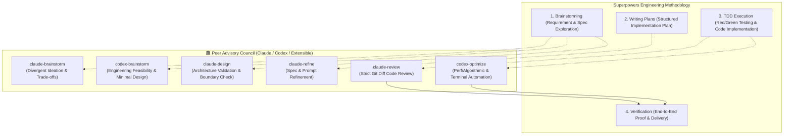

# ⚡ Superpowers + Agent Collaborator Complete Integration Guide

## 1. What is Superpowers?

[Superpowers](https://github.com/obra/superpowers) is an open-source software engineering methodology framework for AI coding agents. It equips AI agents with:
* **Brainstorming & Spec First**: Guided exploration of user requirements decomposed into bite-sized specifications before writing code.
* **TDD & Implementation Planning**: Structured red/green unit testing with step-by-step implementation plans.
* **Single-Flow Execution & Verification**: Disciplined task execution with rigorous acceptance verification.

---

## 2. Installing Superpowers

Install Superpowers depending on your primary driver environment:

### 🌐 Antigravity
Run in your terminal:
```bash
agy plugin install https://github.com/obra/superpowers
```
*(If `agy` CLI is not installed, you can clone the repository directly into `~/.gemini/config/plugins/superpowers` or your project's `.agent/skills/` directory)*

### 🤖 Claude Code
In Claude Code chat:
```text
/plugin install superpowers@claude-plugins-official
```
Or add the community marketplace:
```text
/plugin marketplace add obra/superpowers-marketplace
/plugin install superpowers@superpowers-marketplace
```

### 🖱️ Cursor
In Cursor Agent chat:
```text
/add-plugin superpowers
```

---

## 3. Injecting Agent Collaborator into the Superpowers Workflow

After installing Superpowers, install `agent-collaborator` as your peer agent collaborator:

```bash
cd /path/to/your/project
/path/to/agent-collaborator/install.sh --project .
```

Since Superpowers/Antigravity are driven by your project's `AGENTS.md`, `--project` now **automatically injects** the collaboration protocol (from `templates/AGENTS.md`) into `AGENTS.md` at your project root for you — idempotently, and without touching any of your existing content. Pass `--no-agents-md` if you'd rather do it by hand, or want to review the exact block first: it is reproduced below for reference.

```markdown
# 🤝 Multi-Agent Peer Collaboration & Verification Protocol

## 1. Roles & Division of Labor
- **Central Orchestrator (Antigravity / Gemini)**: Full context awareness, toolchain execution, TDD implementation, and fallback.
- **Peer Advisory Council (Claude CLI / OpenAI Codex / Custom)**:
  - `claude-brainstorm` (or `bash ~/.gemini/config/skills/agent-collaborator/scripts/claude_brainstorm.sh`): Ideation & approach trade-offs (2-3 distinct approaches)
  - `codex-brainstorm` (or `bash ~/.gemini/config/skills/agent-collaborator/scripts/codex_brainstorm.sh`): Engineering feasibility, standard library alternatives & contrarian perspectives
  - `claude-design` (or `bash ~/.gemini/config/skills/agent-collaborator/scripts/claude_design.sh`): Architectural design & state-machine exploration
  - `claude-refine` (or `bash ~/.gemini/config/skills/agent-collaborator/scripts/claude_refine.sh`): Spec & prompt optimization
  - `claude-review` (or `bash ~/.gemini/config/skills/agent-collaborator/scripts/claude_review.sh`): Pre-flight git diff code review
  - `codex-optimize` (or `bash ~/.gemini/config/skills/agent-collaborator/scripts/codex_optimize.sh`): Algorithmic/performance analysis & terminal/CI automation, using Codex's actual strengths (Terminal-Bench-leading agentic shell tasks, cheaper per-task on high-volume work). Codex's **Computer Use** (GUI screen/mouse/keyboard control) only exists in the Codex desktop app, not this headless script — route GUI-verification needs there.
  - *(Extensible: Add other custom peer agent scripts under `.agent/skills/` or `~/.local/bin/`)*

> **Execution Note for Antigravity (Gemini)**:
> 1. **Sandbox Bypass**: External peer agent tools (`claude-brainstorm`, `claude-design`, `claude-refine`, `claude-review`) execute host binaries (`~/.local/bin/claude`) and require internet access. You **MUST** execute them via `run_command` with `BypassSandbox: true`.
> 2. **Direct Invocation**: Directly invoke `claude-brainstorm`, `codex-brainstorm`, `claude-design`, `claude-refine`, or `claude-review` (in `~/.local/bin` on PATH) or use `bash ~/.gemini/config/skills/agent-collaborator/scripts/<script>.sh`. Do NOT spend turns running `which` or searching for scripts.
> 3. **Sandbox Error Handling**: If exit 126 or "Operation not permitted" occurs, it means `BypassSandbox: true` was omitted. Immediately re-run with `BypassSandbox: true`. Do NOT switch to fallback.

## 2. Mandatory Rules
- **Brainstorming / Plan**: Proactively consult peer agents (`claude-brainstorm` / `codex-brainstorm` / `claude-design` / `claude-refine`) with `BypassSandbox: true` to cross-reference designs and explore edge cases.
- **Pre-flight Verification**: Run `claude-review` with `BypassSandbox: true` before finalizing plans or claiming task completion.
- **Background Execution Synchronization**: When `claude-brainstorm`, `codex-brainstorm`, `claude-design` or `claude-review` runs in background (~15-30s), **DO NOT** prematurely output "設計已完成" or finalize `implementation_plan.md`. Yield the turn (stop calling tools) and wait for the reactive wake-up message, then synthesize peer findings into the final plan.
- **Sandbox vs Fallback**:
  - Exit 126 / Sandbox Block: Re-run with `BypassSandbox: true`.
  - Exit 100 / Rate limit / Quota failure: Antigravity seamlessly continues internally with its own reasoning.
```

---

## 4. Multi-Agent + Superpowers Golden Pipeline

When Superpowers is combined with Agent Collaborator, every engineering milestone is double-checked by peer models:


