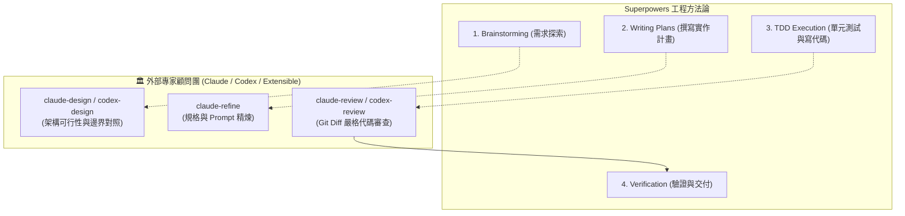

# ⚡ Superpowers + Claude Collaborator 完整整合指南

## 1. 什麼是 Superpowers？

[Superpowers](https://github.com/obra/superpowers) 是由社群維護的開源 Coding Agent 軟體工程方法論框架。它為 AI 代理人提供了：
* **Brainstorming & Spec First**：在寫 code 之前，先引導使用者釐清需求並拆解成小塊規格。
* **TDD & Implementation Planning**：撰寫嚴格的紅/綠單元測試與分步實作計畫。
* **Single-Flow Execution & Verification**：單流任務推進與強制交付驗收紀律。

---

## 2. 如何安裝 Superpowers？

根據您使用的主程式環境進行安裝：

### 🌐 Antigravity
在終端機中執行：
```bash
agy plugin install https://github.com/obra/superpowers
```
*(若無 `agy` 指令，亦可直接將 repo clone 至 `~/.gemini/config/plugins/superpowers` 或專案目錄的 `.agent/skills/`)*

### 🤖 Claude Code
在 Claude Code 對話中輸入：
```text
/plugin install superpowers@claude-plugins-official
```
或新增社群市集：
```text
/plugin marketplace add obra/superpowers-marketplace
/plugin install superpowers@superpowers-marketplace
```

### 🖱️ Cursor
在 Cursor Agent 聊天框中輸入：
```text
/add-plugin superpowers
```

---

## 3. 將 Claude Collaborator 注入 Superpowers 工作流

安裝完 Superpowers 後，將 `claude-collaborator` 安裝為雙代理人協作者：

```bash
cd /path/to/your/project
/path/to/claude-collaborator/install.sh --project .
```

接著在專案根目錄的 `.agent/AGENTS.md` 加入以下契約：

```markdown
# 🤝 Multi-Agent Peer Collaboration & Verification Protocol

## 1. Roles & Division of Labor
- **Central Orchestrator (Antigravity / Gemini)**: Full context awareness, toolchain execution, TDD implementation, and fallback.
- **Peer Advisory Council (Claude CLI / OpenAI Codex / Custom)**:
  - `claude_design.sh`: Architectural design & state-machine exploration
  - `claude_refine.sh`: Spec & prompt optimization
  - `claude_review.sh`: Pre-flight git diff code review
  - *(Extensible: Add Codex or custom peer agent scripts under `.agent/skills/`)*

## 2. Mandatory Rules
- **Brainstorming / Plan**: Proactively consult peer agents (`claude-design` / `claude-refine`) to cross-reference designs and explore edge cases.
- **Pre-flight Verification**: Run `claude-review` before finalizing plans or claiming task completion.
- **Self-Healing Fallback**: If external peers hit limits (exit code 100), Antigravity seamlessly continues internally.
```

---

## 4. 雙代理人 + Superpowers 的黃金流水線

當 Superpowers 遇上 Agent Collaborator 時，每個階段都有多模型把關：


