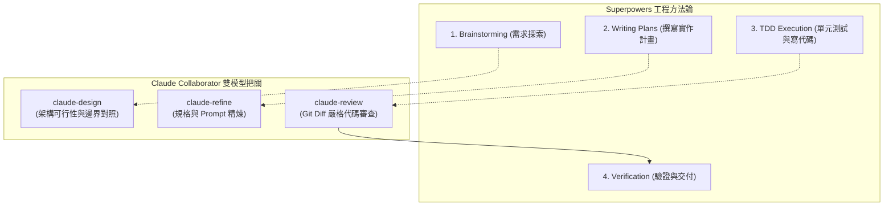

# ⚡ Superpowers + Claude Collaborator 完整整合指南

## 1. 什麼是 Superpowers？

[Superpowers](https://github.com/obra/superpowers) 是由社群維護的開源 Coding Agent 軟體工程方法論框架。它為 AI 代理人提供了：
* **Brainstorming & Spec First**：在寫 code 之前，先引導使用者釐清需求並拆解成小塊規格。
* **TDD & Implementation Planning**：撰寫嚴格的紅/綠單元測試與分步實作計畫。
* **Single-Flow Execution & Verification**：單流任務推進與強制交付驗收紀律。

---

## 2. 如何安裝 Superpowers？

根據您使用的主程式環境進行安裝：

### 🌐 Antigravity
在終端機中執行：
```bash
agy plugin install https://github.com/obra/superpowers
```
*(若無 `agy` 指令，亦可直接將 repo clone 至 `~/.gemini/config/plugins/superpowers` 或專案目錄的 `.agent/skills/`)*

### 🤖 Claude Code
在 Claude Code 對話中輸入：
```text
/plugin install superpowers@claude-plugins-official
```
或新增社群市集：
```text
/plugin marketplace add obra/superpowers-marketplace
/plugin install superpowers@superpowers-marketplace
```

### 🖱️ Cursor
在 Cursor Agent 聊天框中輸入：
```text
/add-plugin superpowers
```

---

## 3. 將 Claude Collaborator 注入 Superpowers 工作流

安裝完 Superpowers 後，將 `claude-collaborator` 安裝為雙代理人協作者：

```bash
cd /path/to/your/project
/path/to/claude-collaborator/install.sh --project .
```

接著在專案根目錄的 `.agent/AGENTS.md` 加入以下契約：

```markdown
## Claude Collaborator Workflow (Dual-Agent Mode)

**Mandatory Rule for Design & Review**: For ANY architectural design, feature planning, prompt/spec tuning, or system exploration:
- **Always proactively consult and discuss with Claude** (`claude-collaborator` skill) to cross-reference designs, explore trade-offs, and validate assumptions before finalizing plans or writing major code.
- Use `claude_design.sh` for architectural/state design, solution comparison, and deep research before writing code.
- Use `claude_refine.sh` for prompts, schemas, specs, or domain documents.
- Use `claude_review.sh` for code review and regression checking before claiming completion of critical tasks.
- If Claude hits usage limits or connection issues, seamlessly follow the self-healing fallback protocol without halting the task.
```

---

## 4. 雙代理人 + Superpowers 的黃金流水線

當 Superpowers 遇上 Claude Collaborator 時，每個階段都有雙模型把關：


