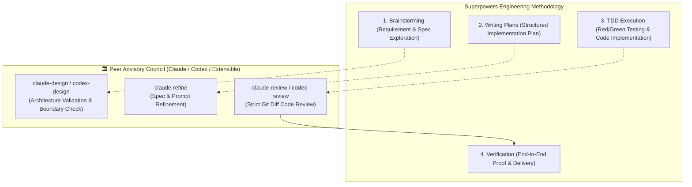

# ⚡ Superpowers + Agent Collaborator Complete Integration Guide

## 1. What is Superpowers?

[Superpowers](https://github.com/obra/superpowers) is an open-source software engineering methodology framework for AI coding agents. It equips AI agents with:
* **Brainstorming & Spec First**: Guided exploration of user requirements decomposed into bite-sized specifications before writing code.
* **TDD & Implementation Planning**: Structured red/green unit testing with step-by-step implementation plans.
* **Single-Flow Execution & Verification**: Disciplined task execution with rigorous acceptance verification.

---

## 2. Installing Superpowers

Install Superpowers depending on your primary driver environment:

### 🌐 Antigravity
Run in your terminal:
```bash
agy plugin install https://github.com/obra/superpowers
```
*(If `agy` CLI is not installed, you can clone the repository directly into `~/.gemini/config/plugins/superpowers` or your project's `.agent/skills/` directory)*

### 🤖 Claude Code
In Claude Code chat:
```text
/plugin install superpowers@claude-plugins-official
```
Or add the community marketplace:
```text
/plugin marketplace add obra/superpowers-marketplace
/plugin install superpowers@superpowers-marketplace
```

### 🖱️ Cursor
In Cursor Agent chat:
```text
/add-plugin superpowers
```

---

## 3. Injecting Agent Collaborator into the Superpowers Workflow

After installing Superpowers, install `claude-collaborator` as your peer agent collaborator:

```bash
cd /path/to/your/project
/path/to/agent-collaborator/install.sh --project .
```

Then append the following collaboration protocol to `.agent/AGENTS.md` at your project root:

```markdown
# 🤝 Multi-Agent Peer Collaboration & Verification Protocol

## 1. Roles & Division of Labor
- **Central Orchestrator (Antigravity / Gemini)**: Full context awareness, toolchain execution, TDD implementation, and fallback.
- **Peer Advisory Council (Claude CLI / OpenAI Codex / Custom)**:
  - `claude_design.sh`: Architectural design & state-machine exploration
  - `claude_refine.sh`: Spec & prompt optimization
  - `claude_review.sh`: Pre-flight git diff code review
  - *(Extensible: Add Codex or custom peer agent scripts under `.agent/skills/`)*

## 2. Mandatory Rules
- **Brainstorming / Plan**: Proactively consult peer agents (`claude-design` / `claude-refine`) to cross-reference designs and explore edge cases.
- **Pre-flight Verification**: Run `claude-review` before finalizing plans or claiming task completion.
- **Self-Healing Fallback**: If external peers hit limits (exit code 100), Antigravity seamlessly continues internally.
```

---

## 4. Multi-Agent + Superpowers Golden Pipeline

When Superpowers is combined with Agent Collaborator, every engineering milestone is double-checked by peer models:


